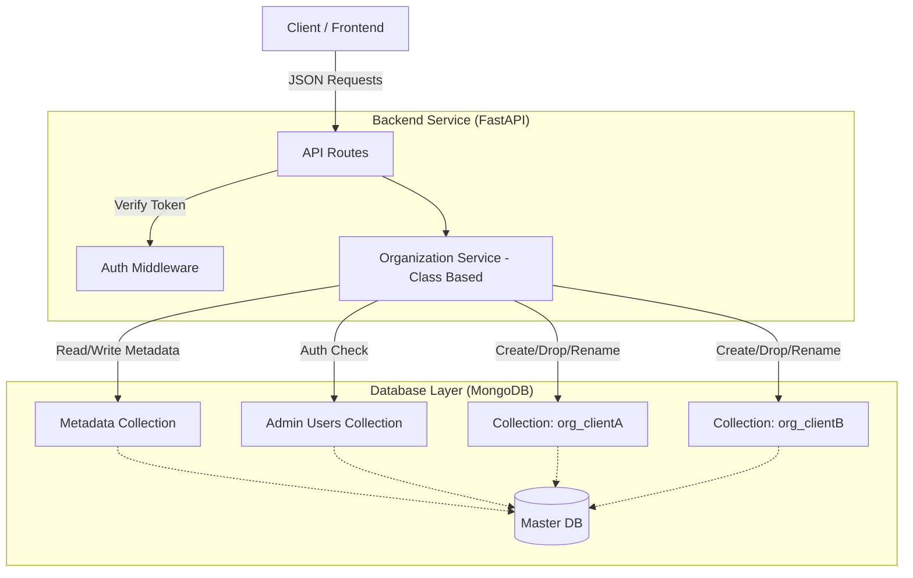

1.  **Clone the Repository**
2.  **Create a Virtual Environment:**
    ```bash
    python -m venv venv
    source venv/bin/activate  # Windows: venv\Scripts\activate
    ```
3.  **Install Dependencies:**
    ```bash
    pip install -r requirements.txt
    ```
4.  **Environment Variables:**
    Create a `.env` file in the root:
    ```
    MONGO_URL=mongodb://localhost:27017
    DB_NAME=master_org_db
    SECRET_KEY=change_this_secret
    ```
5.  **Run the Server:**
    ```bash
    uvicorn app.main:app --reload
    ```
6.  **Access Docs:**
    Go to `http://127.0.0.1:8000/docs` to test the APIs interactively.

## Architecture Diagran
